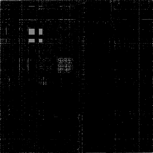
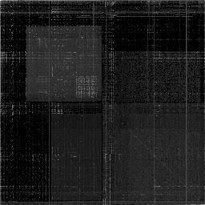
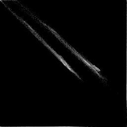
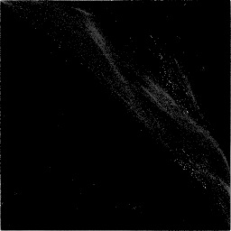
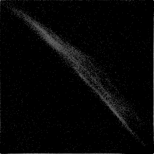

# Binary Visualization

Binary Visualization based on Christopher Domas talk: https://www.youtube.com/watch?v=4bM3Gut1hIk

## x86_64 ELF executables





## RGBA32 Raw Images





## Quick Start

```console
$ cc -o nob nob.c
$ ./nob binviz ./nob.c
$ feh ./nob.c.binviz.png
```
